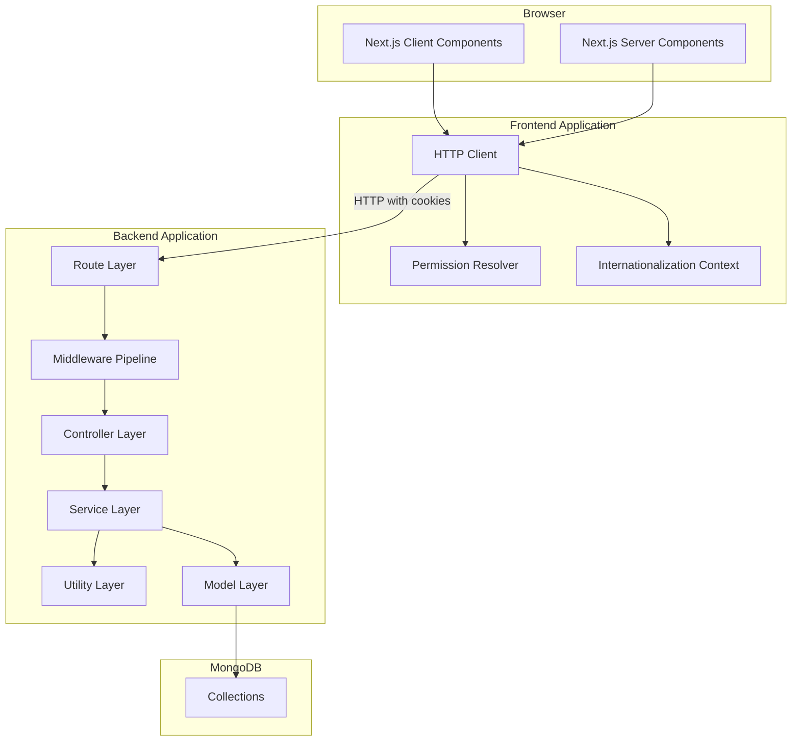
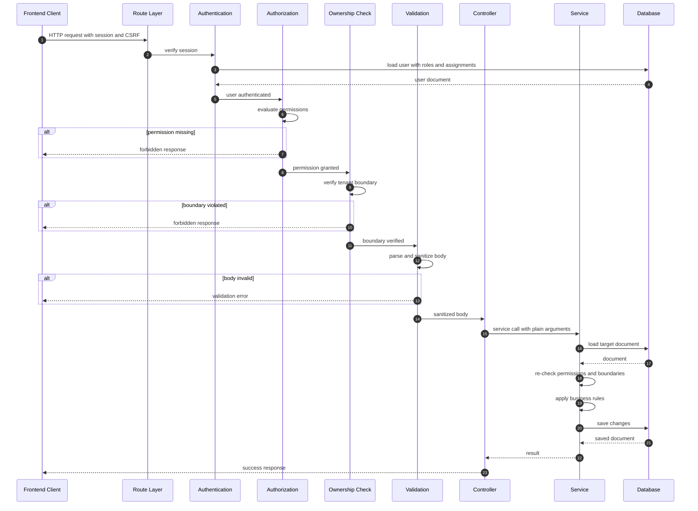
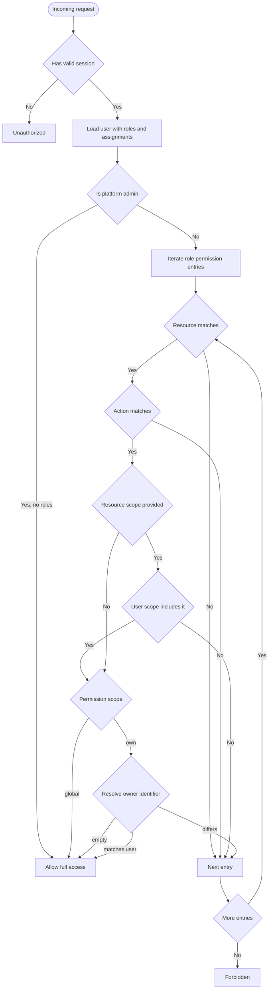
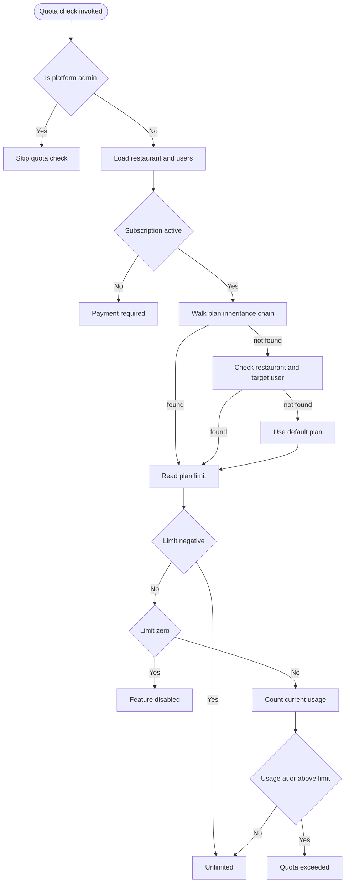
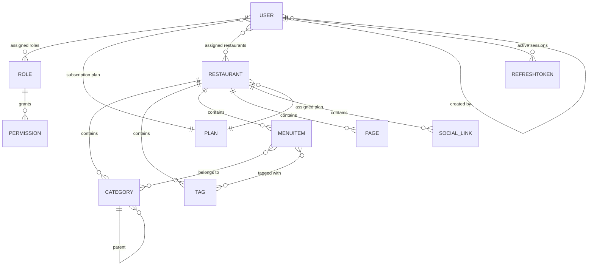

# Technical Architecture & Design Documentation

A Multi-Tenant SaaS Platform for Restaurant Operations

---

## Table of Contents

1. Project Overview
2. High-Level Architecture
3. Folder Structure & Engineering Justification
4. Design Patterns & SOLID Principles in Practice
5. Data Flow & Layer Relationships
6. Complex Technical Challenges
7. Mermaid Diagrams
8. Engineering Trade-offs & Future Improvements

---

## 1. Project Overview

This is a multi-tenant SaaS platform built for the restaurant industry. It allows restaurant operators to publish a public-facing digital experience (menu, informational pages, contact channels) and to manage that content through a fully authenticated dashboard. Platform administrators operate above individual tenants and manage global configuration, role templates, subscription plans, and platform-wide content.

The system is not a single-tenant tool with a few extra fields. It was designed from the ground up as a true multi-tenant system with strict isolation guarantees at the data layer, a three-dimensional role-based access control engine, a subscription tiering system with per-resource quotas, and a content model that treats translation as a first-class concern rather than an afterthought.

### Technology Stack

| Layer | Technology |
|---|---|
| Frontend Framework | Next.js 16 (App Router), React 19, TypeScript |
| Styling | TailwindCSS 4 |
| Rich Text Editing | Tiptap 3 |
| Data Tables | TanStack Table |
| Backend Runtime | Node.js 20 |
| Web Framework | Express 5 |
| ODM | Mongoose 9 |
| Database | MongoDB 7 |
| Validation | Zod 4 |
| Authentication | JWT with refresh token rotation, HTTP-only cookies |
| Password Hashing | bcryptjs |
| CSRF Protection | csurf |
| Deployment | Docker Compose (per-service dev containers) |

### Core Capabilities

The platform handles the following functional domains:

- Multi-tenant restaurant management with per-tenant configuration
- Hierarchical content organization (categories, tags, items)
- Localized content across an arbitrary number of languages
- A flexible role and permission system supporting both platform-level and tenant-level actors
- Subscription plans with resource quotas, feature gates, and expiration handling
- A visual theme customization system with live preview
- A dynamic form builder that produces embeddable contact forms
- A public CMS layer for platform-wide informational content
- SEO-optimized public pages with structured data
- Site-wide internationalization covering the entire user interface

---

## 2. High-Level Architecture

### Architectural Choice

The platform is built as a strictly layered monolith. I evaluated three architectural shapes during the initial design phase and made a deliberate decision not to build microservices.

The alternatives I considered were:

1. Full Clean Architecture with use-case classes and port/adapter boundaries. The cost of this approach is that every operation requires an interface definition and a concrete implementation, and the abstraction is only repaid when a second adapter for the same port actually materializes. In a system where the persistence layer is a single MongoDB instance that will not be swapped, the port abstraction becomes ceremony rather than safety.

2. Microservices. Splitting the system into independently deployable services would have introduced distributed transactions for cross-service operations that today are simple database reads. The plan limit checker, for example, needs to read a user's plan, walk an inheritance chain, count documents in an unrelated collection, and then throw an error. In a monolith this is one function call. In microservices it becomes a saga. The operational complexity would have been paid immediately, while the scalability benefits would only materialize under a scale this project will not reach in the near term.

3. A strictly layered monolith with clean separation between HTTP handling, business logic, and persistence. This is what was built.

The layering follows a single rule that has proven effective: HTTP concerns live only in the HTTP layer, and business rules live only in the service layer. Controllers do not talk to the database directly, and services do not accept request or response objects as parameters.

### Layer Overview

The backend is organized into six conceptual layers, each with a distinct responsibility.

The first layer is the route layer. Route files are declarative. They wire URL patterns to middleware chains and terminal controllers. Route files contain no business logic and no conditional branching. If you are reading a route file and you see an if statement, it belongs somewhere else.

The second layer is the middleware pipeline. Middleware runs before the controller and handles cross-cutting concerns. Authentication middleware verifies the session. Authorization middleware performs coarse-grained permission checks against the user's role set. Ownership middleware verifies tenant boundaries. Validation middleware parses and sanitizes the request body. Rate limiting middleware throttles abusive clients. Each middleware has exactly one responsibility, and each is independently testable.

The third layer is the controller layer. Controllers are the smallest files in the codebase by design. A controller method extracts parameters from the request, invokes exactly one service method, and serializes the result into a response. The interesting work is never in a controller.

The fourth layer is the service layer. This is where the platform's actual behavior lives. Services implement business rules, enforce fine-grained permissions, apply quota checks, resolve slugs, orchestrate multi-collection reads and writes, and validate invariants that the middleware layer cannot see. A service method accepts plain arguments and the authenticated user object, and returns plain data or throws a domain error. It has no knowledge of HTTP.

The fifth layer is the model layer. Models are Mongoose schemas with indexes, validation rules, and occasionally small hooks. Models do not contain business logic beyond what is needed to enforce a structural invariant.

The sixth layer is the utility layer. Utilities are pure functions with no dependencies on Express or Mongoose documents where possible. The RBAC permission resolver, the plan inheritance walker, the error hierarchy, and the role helper functions all live here. Keeping these pure makes them trivially testable and reusable from anywhere in the stack.

---

## 3. Folder Structure & Engineering Justification

### Backend Structure

The backend source is organized into the following top-level directories.

The `constants` directory holds immutable enumerations and matrices that are referenced from multiple layers. The permissions matrix, which defines which resources and actions are available to each role category, lives here. This keeps the definition of "what is allowed" separate from the enforcement of "who is allowed."

The `controllers` directory holds one file per resource. Controllers are HTTP adapters and nothing more.

The `middleware` directory holds cross-cutting concerns that run before controllers. Each file is a single focused concern. There is no file named `utils.js` in this directory because bundling unrelated middleware into a single file defeats the purpose of the pipeline.

The `models` directory holds Mongoose schemas. Every model defines its indexes explicitly. Compound indexes are chosen based on the query patterns that the service layer actually issues, not based on guesses.

The `routes` directory holds URL-to-handler wiring. Route files are deliberately boring.

The `schemas` directory holds Zod validators. These are pure functions on plain objects, meaning they can be unit tested without a running server, and they can be reused by future entry points (WebSocket handlers, CLI tools, background jobs) without modification.

The `services` directory holds the business logic. Every file here is a class of static methods. Static methods were chosen over instance methods because services are stateless; there is no state to encapsulate in an instance, and requiring `new PageService()` everywhere would be ceremony.

The `utils` directory holds pure helpers. The RBAC resolver, the plan resolver, the error hierarchy, and the limit checker all live here.

The `scripts` directory holds one-off operations. Database migrations, seed scripts, and RBAC integration test suites are here. These are not part of the application runtime.

### Frontend Structure

The frontend is organized around the Next.js App Router with the following top-level directories.

The `app` directory contains all routes. Route groups are organized by functional domain rather than by user role, which means administrators and restaurant operators share the same page components and permission gating happens inside each page rather than through tree duplication. This reduces the surface area for behavior divergence between roles.

The `components` directory contains React components. It is organized into a `ui` subdirectory for primitive components, a `layout` subdirectory for structural components, and one subdirectory per functional domain. This mirrors the backend service structure, which makes it easy to trace a feature end-to-end.

The `lib` directory contains shared utilities. The HTTP client, the permission resolver mirror, the internationalization context, and the server-side session helpers all live here. The HTTP client is the single point through which all network calls flow, which is where retry logic, CSRF injection, and error normalization are centralized.

---

## 4. Design Patterns & SOLID Principles in Practice

### Service Layer Pattern

Every meaningful operation is implemented as a static method on a service class. Controllers call exactly one service method per request. This means that the same operation can be invoked from a controller, a background job, a CLI tool, or a test without duplicating logic. The service is the atomic unit of business behavior.

### Chain of Responsibility

The middleware pipeline is a chain of responsibility where each middleware either terminates the request or passes it to the next link. Each link has a single purpose. The chain is composed in route definitions, which means the pipeline for a specific route is visible at a glance without needing to open any middleware file.

### Strategy Through Pure Functions

The RBAC engine is implemented as a pure function. Given a user document, a resource name, and an action name, the function returns one of three values: a global scope marker, an own scope marker, or null. It performs no database queries and has no side effects. This design has three consequences. First, the middleware can call it cheaply on every request. Second, the same function is mirrored on the frontend for UI gating, which would not be possible if it depended on server-side state. Third, the function is trivially unit-testable.

### Template Method Through Error Hierarchy

A base application error class defines the shared shape of every error that flows through the system: a message, an HTTP status code, a machine-readable code, a details payload, and a timestamp. Specialized subclasses for authentication, authorization, not found, validation, conflict, quota, feature-disabled, database, and rate-limit errors each override only the constructor defaults. The base class implements serialization and stack capture once, and every subclass inherits those behaviors. The conversion layer that maps Mongoose and Mongo driver errors into this hierarchy is a thin adapter, which means controllers and services only ever throw domain errors.

### Factory Pattern

A centralized error factory exposes named constructors for each error type. Services call descriptive factory methods rather than constructing error instances directly. This centralizes the shape of the errors and makes it possible to add a new field to every error of a given type by changing one place.

### Singleton Pattern

Rate limiters are module-level singletons. Each limiter holds an in-memory map from client identifier to request count and reset time. Creating a new limiter per request would be meaningless because the state is the entire point. The limiters expose a middleware method that is composed into route chains.

### Repository Pattern, Applied Pragmatically

I do not wrap Mongoose in a repository interface because I will never swap the database and the abstraction cost would not be repaid. Instead, I apply a lighter version of the same principle: read-heavy paths use Mongoose's `.lean()` to skip document hydration when the caller only needs a plain object, and write-heavy paths use full documents so that change tracking and hooks remain available. The choice is made per query, not per model.

### SOLID Principles

The Single Responsibility Principle is visible in the boundary between controllers and services. A controller serializes HTTP. A service enforces business rules. Neither does the other's job.

The Open/Closed Principle is visible in the permissions matrix, which is a constant that can be extended without modifying any controller or service. Adding a new resource means adding an entry to the matrix, not editing the enforcement logic.

The Liskov Substitution Principle is visible in the error hierarchy. Any specialized error can be used anywhere a base application error is expected, because the subclasses only override constructor defaults.

The Interface Segregation Principle is visible in the frontend hooks. Each custom hook exposes only the state and operations that its consumers need. The cart hook, for example, does not expose the internal storage keys or initialization flag to its callers.

The Dependency Inversion Principle is visible in the service signatures. Services accept the authenticated user object and plain data, not the request object. This means services can be called from a test without constructing a fake request.

---

## 5. Data Flow & Layer Relationships

This section traces a single authenticated write request from the browser to the database and back, describing what happens at each layer.

### Request Initiation

The user interacts with a client component in the frontend. The component calls a typed helper function from the HTTP client library. The HTTP client attaches the CSRF token to the request headers, sets the credentials mode to include cookies, and issues the request.

### Route Dispatch

The Express application matches the incoming URL to a route definition. The route definition lists the middleware chain that must run before the controller. The order is significant.

### Authentication Middleware

The authentication middleware extracts the session token from the request, either from the authorization header or from a cookie. It verifies the token's signature and expiration, loads the user from the database with the roles, restaurant assignments, and plan populated, and attaches the user object to the request. If the token is missing or invalid, the middleware returns an unauthorized response.

### Authorization Middleware

The authorization middleware evaluates the user's role set against the requested resource and action. Platform administrators short-circuit this evaluation and are always allowed. Non-administrators are evaluated by iterating their roles and checking each permission entry. The first matching permission allows the request. If no permission matches, the middleware returns a forbidden response.

### Ownership Middleware

The ownership middleware enforces tenant boundaries. Platform administrators are allowed to proceed. Non-administrators must have the target restaurant in their assigned restaurant list. If the parameter is not a valid database identifier, the middleware attempts to resolve it as a slug before making the comparison. If the user does not own or operate the target restaurant, the middleware returns a forbidden response.

### Validation Middleware

The validation middleware runs a Zod schema against the request body. On success, the parsed and sanitized object replaces the original body. On failure, the middleware throws a validation error with per-field messages, which the centralized error handler formats into a structured response.

### Controller

The controller extracts the necessary parameters from the request, calls exactly one service method, and serializes the result.

### Service

The service re-checks permissions and tenant boundaries. This is not redundant. It protects against programmatic invocation of the service outside the HTTP pipeline, and it protects against future changes to the middleware chain that might accidentally weaken a guard.

The service then performs its business logic: loading the affected document, resolving any conflicts (such as slug uniqueness), applying the requested changes, and saving the result.

### Error Handling

If any layer throws an error, the centralized error handler converts it into the domain error hierarchy, logs it with a unique request identifier, sanitizes it based on the environment, and returns a structured response.

### Response and Client Handling

The frontend HTTP client receives the response. If the response indicates an expired session, the client transparently refreshes the session and retries the request once. If the response indicates a permission or validation failure, the client surfaces a structured error that the UI translates into localized, user-facing copy.

---

## 6. Complex Technical Challenges

This section describes three problems that required non-trivial engineering.

### Challenge One: Quota Resolution Across Multiple Inheritance Paths

The platform applies resource quotas based on a subscription plan. The plan that applies to a given operation is not always obvious. It may be attached directly to the acting user. It may be inherited from an ancestor in the user creation chain, because staff accounts are commonly created by managers who were themselves created by owners, and the owner is the one who holds the paid plan. It may be attached to the restaurant itself, because a platform administrator may have assigned a specific plan to a specific tenant. Or it may fall back to the platform's default plan.

The naive implementation walks the inheritance chain with a simple recursive call. This fails when the chain contains a cycle, which can happen if an administrator reassigns ownership in a way that creates a loop. It also fails to bound the depth of the walk, which means a corrupted chain can pin a CPU core.

The implemented solution walks the inheritance chain iteratively with two safety rails. The first is a visited set that detects cycles and stops the walk. The second is a maximum depth cap that stops the walk even if the visited set logic is bypassed. The walk returns the first active, non-deleted plan it encounters.

Once the plan is resolved, the quota checker extracts the relevant limit from the plan's limits object and compares it against the current count of the resource. The count is scoped to the restaurant, not to the user, because most resources are restaurant-owned rather than user-owned. Two special cases exist: restaurant counts are user-owned, and role counts differ from other resources because roles may be tenant-scoped or platform-scoped.

The function also short-circuits for unlimited plans (limits set to negative one), and it raises a feature-disabled error for limits set to zero, distinguishing between "you have exhausted your quota" and "your plan does not include this feature."

### Challenge Two: Reordering Hierarchical Items With Position Shifting

Categories on the platform are hierarchical and ordered. Each category has a parent (or none) and a position within its parent's children. Moving a category within its parent, or between parents, requires shifting the positions of the other affected siblings.

The naive implementation reads all siblings, rewrites each one, and saves them individually. This is linear in the number of siblings, and it opens a race window between the read and the write during which another concurrent move can corrupt the ordering.

The implemented solution uses two bulk update operations per move instead of one save per sibling. The first bulk update closes the gap left by the moved item in its original position. The second bulk update opens a gap at the new position.

Two distinct branches exist for two distinct semantics. When the parent does not change, only the siblings whose positions fall between the old and new positions need to shift. When the parent changes, the siblings in the old parent's list collapse toward zero, and the siblings in the new parent's list expand.

The atomicity guarantee comes from using the increment operator on the position field. The database applies the increment atomically per document, which eliminates the most dangerous race condition, where two moves both read the same position and both write the same new value.

### Challenge Three: Enforcing Slug Uniqueness Across Tenants and Languages

Every restaurant, page, category, tag, and item has a slug. Slugs must be unique within their parent scope. Two different restaurants may both have a slug named "about-us," but one restaurant may not have two pages with that slug.

The platform also supports translated slugs. A page's primary slug lives on the top-level document, and translated slugs live inside a nested translations map. Uniqueness is enforced on the primary slug only. Translated slugs are treated as best-effort, because enforcing uniqueness across a nested map would require sparse multi-key indexes that MongoDB does not cleanly support.

The implementation resolves conflicts by pre-checking for uniqueness before writing, and by auto-incrementing the slug when a collision is detected. This produces a deterministic user experience: the user types a slug, and the response contains the actual slug that was assigned, which may have a numeric suffix. The alternative approach, which is to insert and retry on a duplicate key error, produces less predictable latency and a worse user experience when a race causes the retry to collide.

The database still has a compound unique index on the slug and the parent scope, so the invariant holds even if two concurrent requests both pass the pre-check and one of them reaches the save operation first.

---

## 7. Mermaid Diagrams

### Diagram One: System Architecture

### Diagram Two: Request Lifecycle

### Diagram Three: Permission Resolution

### Diagram Four: Quota Resolution

### Diagram Five: Entity Relationships

---

## 8. Engineering Trade-offs & Future Improvements

Every codebase is the result of trade-offs. This section documents the choices I made that a reader might reasonably question.

The frontend and backend do not share TypeScript types. The frontend defines its own request and response shapes in the HTTP client module, and the backend defines its own shapes through Zod schemas. This avoids a monorepo build pipeline for a small team, but it means type drift is possible. The mitigation is that Zod schemas reject malformed payloads at the boundary, so drift manifests as a runtime validation error rather than silent corruption.

The RBAC logic is mirrored between backend and frontend. The same permission resolution function exists in both layers. Sharing it through a package would have required either leaking server-side code into the browser bundle or building a workspace. Mirroring a small, stable function was cheaper than the infrastructure. If the function grows or becomes unstable, extracting it becomes worthwhile.

Quota checks run a count query on every create operation. For very large tenants, this could be optimized with denormalized counters. Denormalized counters introduce drift between the counter and reality, which then requires reconciliation jobs. I chose the correctness of an authoritative count over the performance of a cached one. If a specific resource becomes hot, the count can be cached with a short TTL, but only after measurement justifies it.

The rate limiter is in-memory. This means it works correctly on a single process and degrades on horizontal scaling. A distributed rate limiter using Redis would be the next step if the backend scales horizontally. Until then, the in-memory approach avoids an external dependency.

Category reordering is not wrapped in a database transaction. Each individual position increment is atomic, but two concurrent moves can in theory produce overlapping positions. The system tolerates this because reordering is an infrequent operation and a consistency reconciliation could be added later. Wrapping the operation in a transaction would require a replica set, which I did not want to impose on local development.

Slug uniqueness is enforced in application code and in a database index. The application check produces a clean user experience, and the database index is the ultimate guarantee. Removing the application check and relying only on the index would produce duplicate-key errors under race conditions, which the error handler already converts into a conflict response, but the user experience would be worse.

The theme system stores a deep copy of the draft configuration in a published slot. This means there is always a preview state and a live state, and there is no partial-publish condition. The trade-off is that the theme document can grow to a few kilobytes. For MongoDB, this is well within normal document sizes.
